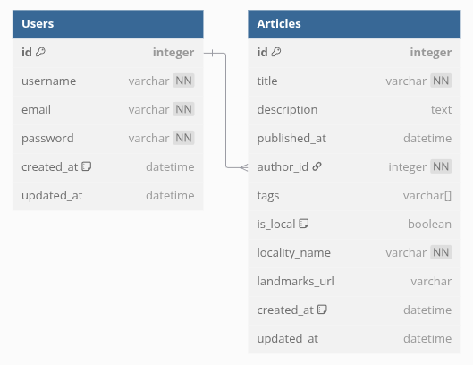

# Beyond The Map

> Beyond The Map

 - BeyondTheMap is a modern REST API built with NestJS, designed for creating and publishing vivid stories and impressions about cities and towns in Belarus.

[](https://nodejs.org/)
[](https://nestjs.com/)
[](https://www.typescriptlang.org/)
[](https://www.postgresql.org/)

[](https://redis.io/)
[](https://jwt.io/)
[](https://typicode.github.io/husky/)
[](https://eslint.org/)
[](https://prettier.io/)

---

[Description](#description) •
[Project setup](#project-setup) •
[Features](#features) •
[How To Use](#how-to-use) •
[Project Status](#project-status) •
[Room for Improvement](#room-for-improvement) •
[License](#license) •
[Contact](#contact)

## Description

BeyondTheMap is a cutting-edge REST API developed using the NestJS framework, aimed at enabling users to create, share, and explore authentic stories and personal impressions about cities, towns, and settlements across Belarus. The platform focuses on capturing the unique atmosphere and experiences that inspire authors to write — whether it’s the bustling energy of a city or the charm of a small village.

Featuring robust user authentication with JWT, full CRUD functionality for managing articles, advanced filtering and pagination, and efficient caching with Redis, BeyondTheMap ensures a seamless and performant experience. The backend is powered by PostgreSQL with TypeORM for reliable data management and migration support.

This project serves as a foundation for a larger ecosystem that will eventually include a rich frontend interface, providing users with an engaging way to discover Belarus beyond conventional maps and guides, through the eyes of those who have been truly moved by its places.

> #### Technologies: 
> - **Node.js** and **NestJS** for server and routing
> - **TypeScript** for type safety and modern JS features
> - **PostgreSQL** with **TypeORM** for relational database management
> - **Redis** for token blacklist storage
> - **JWT** for authentication tokens
> - **bcrypt** for password hashing
> - **Husky**, **ESLint**, **Prettier**, **Commitlint** for code quality and git hooks

#### ERD:

<details>

[](https://dbdiagram.io/d/beyond-the-map-682e3d7bb9f7446da3942ac7)

</details>

- [ERD File](./.githab/erd.png)

- [to ERD on dbdiagram.io](https://dbdiagram.io/d/beyond-the-map-682e3d7bb9f7446da3942ac7)


## Project setup

- Clone this repo to your desktop and run `npm install` to install all the dependencies.
- Create your .env file with required variables:

```
# Application environment
NODE_ENV=             # Application environment (e.g., development, production)
LOG_LEVEL=            # Logging level (e.g., log, warn, error)
PORT=                 # Server port (e.g., 4000)
API_VERSION=          # API version (e.g., 1)

# Database configuration
DB_HOST=              # Database host (e.g., localhost)
DB_PORT=              # Database port (e.g., 3306)
DB_USER=              # Database username
DB_PASSWORD=          # Database password
DB_NAME=              # Database name

# JWT secrets
ACCESS_TOKEN_SECRET=  # Secret for access tokens
REFRESH_TOKEN_SECRET= # Secret for refresh tokens

# Redis configuration
REDIS_URL=            # Redis connection URL (e.g., redis://localhost:6379)

# TypeORM connection type 
TYPEORM_CONNECTION=   # Type of database connection (e.g., postgres, mysql)

# PostgreSQL  database configuration 
DATABASE_HOST=        # PostgreSQL host
DATABASE_USER=        # PostgreSQL user
DATABASE_PASSWORD=    # PostgreSQL password
DATABASE_NAME=        # PostgreSQL database name

# JWT Constants 
JWT_CONSTANTS_SECRET= # JWT secret key

# Cache TTL 
CACHE_TTL=            # Cache time to live in ms (24h)
```

- Once the dependencies are installed, you can run `npm run dev` to start the application.
- Enjoy.

### Project structure

```shell
.
.
├── .github                      # GitHub-specific files and assets
│   ├── workflows                # GitHub Actions workflows
│   │   └── ci.yml               # Continuous integration workflow
├── .vscode                      # VS Code specific settings
│   └── settings.json            # VS Code settings configuration
├── prisma                       # Prisma schema and migrations
│   ├── migrations               # Database migration files
│   └── schema.prisma            # Prisma schema definition
├── src                          # Application source code
│   ├── auth                     # Authentication module
│   │   ├── dto                  # Data Transfer Objects (DTOs)
│   │   │   ├── login.dto.ts     # Login DTO
│   │   │   └── register.dto.ts  # Register DTO
│   │   ├── auth.controller.ts   # Auth API controllers
│   │   ├── auth.module.ts       # Auth module definition
│   │   ├── auth.service.ts      # Auth service
│   │   └── jwt.strategy.ts      # JWT strategy for authentication
│   ├── common                   # Common utilities and constants
│   │   ├── constants.ts         # Shared constants
│   │   ├── decorators           # Custom decorators
│   │   └── guards               # Auth guards
│   ├── config                   # Configuration files
│   │   ├── app.config.ts        # Application configuration
│   │   └── database.config.ts   # Database configuration
│   ├── main.ts                  # Application entry point
│   ├── user                     # User module
│   │   ├── dto                  # Data Transfer Objects (DTOs)
│   │   │   └── update-user.dto.ts # Update User DTO
│   │   ├── user.controller.ts   # User API controllers
│   │   ├── user.module.ts       # User module definition
│   │   ├── user.service.ts      # User service
│   │   └── user.entity.ts       # User entity definition
├── .env                         # Environment variables
├── .eslintrc.js                 # ESLint configuration
├── .prettierrc                  # Prettier configuration
├── .gitignore                   # List of files/folders ignored by git
├── nest-cli.json                # Nest CLI configuration
├── package.json                 # Project metadata, scripts, dependencies
├── package-lock.json            # Exact dependency versions
├── tsconfig.json                # TypeScript configuration
```

## Features

- User registration and login with secure password hashing
- Access and refresh token management with JWT
- Comprehensive CRUD operations for managing articles
- Advanced filtering and pagination for retrieving articles
- Efficient caching with Redis for performance optimization
- Middleware for authentication and user ID setting
- Strict error handling and validation
- Code quality enforced by ESLint, Prettier, Husky, and Commitlint

<!-- ## How To Use

Run [Live Demo](https://quick-code-beta.vercel.app/)

![tutorial][tutorial] -->

## Project Status

### _In progress._

## Room for Improvement

To do:

- [ ]  Implement API rate limiting and brute-force protection to enhance security
- [ ]  ADevelop a detailed logging mechanism to facilitate easier debugging and monitoring
- [ ]  Improve error handling and validation messages for better user experience
- [ ]  Add localization support to cater to a broader audience
- [ ] ...

Improvement:

- [ ] Develop a rich frontend client application to provide an engaging user interface
Expand user roles and permissions to support more granular access control
- [ ]  Add support for multimedia content in articles for richer storytelling
- [ ] ...

## License

This project is open source and available under the [BSD 3-Clause](../LICENSE.md).

## Contact

Created by [@RimidalU](https://www.linkedin.com/in/uladzimir-stankevich/) - feel free to contact me!

<p align="right"><a href="#start"></a></p>

<!-- MARKDOWN LINKS & IMAGES -->

[tutorial]: ./assets/demo.webp
